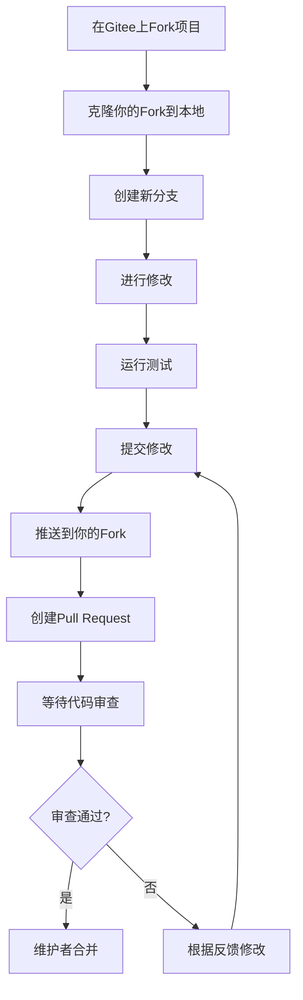

# 贡献指南

感谢你有兴趣为 GADA 做出贡献！无论你是经验丰富的开发者还是刚入门的小白，都欢迎参与。

## 👋 给新贡献者的一封信

**如果你：**
- ❌ 从来没参与过开源项目
- ❌ 不知道GitHub/Gitee怎么用
- ❌ 担心自己的代码不够好
- ❌ 不知道从哪里开始

**别担心！** 每个人都是从零开始的。GADA是一个友好的项目，我们会：
- ✅ **耐心指导**：一步步教你如何贡献
- ✅ **代码审查友好**：不会批评，只会建议改进
- ✅ **从小处开始**：可以从修改文档、修复错别字开始
- ✅ **欢迎所有贡献**：不仅仅是代码，文档、测试、反馈都很重要

## 🚀 快速开始（给完全的新手）

### 第1步：了解基本概念

**什么是"贡献"？**
- 不只是写代码
- 可以是：修复错别字、改进文档、报告Bug、提建议、写教程
- 任何让项目变得更好的行为都是贡献

**什么是Git？**
- 一个版本控制工具（可以理解为"文件的历史记录器"）
- 用来跟踪文件的修改历史
- 多人协作时不会互相覆盖修改

**什么是GitHub/Gitee？**
- 代码托管平台（可以理解为"代码的网盘"）
- 大家把代码放在这里，一起修改
- GADA在Gitee（国内）和GitHub（国外）都有

### 第2步：准备你的电脑

你需要安装：
1. **Git**：下载地址 https://git-scm.com/
2. **Node.js 18+**：下载地址 https://nodejs.org/
3. **一个代码编辑器**：推荐VS Code（免费）

**详细安装步骤**：请参考README.md的"快速开始"部分，有截图级指引。

### 第3步：第一次贡献（从文档开始）

**最简单的贡献方式：修改文档**

#### 方法A：在网页上直接修改（推荐新手）

1. **找到要修改的文件**
   - 打开 https://gitee.com/kai0339/github-deploy-assistant
   - 找到README.md或其他.md文件
   - 点击文件，然后点击"编辑"按钮

2. **进行修改**
   - 比如：发现错别字、语句不通顺
   - 或者：补充你觉得不够清楚的地方

3. **提交修改**
   - 填写"修改说明"（简单描述你改了啥）
   - 点击"提交"
   - 系统会自动创建修改请求

#### 方法B：在本地修改（稍微复杂但更灵活）

```bash
# 1. 复制项目到你的电脑（这叫"fork"）
# 在Gitee页面点击右上角的"Fork"按钮
# 然后你会得到你自己的副本

# 2. 下载你的副本到电脑
git clone https://gitee.com/你的用户名/github-deploy-assistant.git
cd github-deploy-assistant

# 3. 安装依赖
npm install

# 4. 启动项目，看看效果
npm run dev
# 打开浏览器访问 http://localhost:3456

# 5. 修改文件
# 用VS Code或其他编辑器修改文件

# 6. 提交修改
git add .  # 添加所有修改
git commit -m "docs: 修复了README中的错别字"  # 提交修改
git push origin main  # 推送到你的副本

# 7. 创建合并请求
# 回到Gitee你的项目页面
# 点击"Pull Request" → "新建Pull Request"
# 填写说明，等待审核
```

### 第4步：等待审核

- 项目维护者会查看你的修改
- 可能会提一些改进建议
- 根据建议修改后再次提交
- 审核通过后，你的修改就会被合并到主项目！

## 🔧 开发环境（给想写代码的贡献者）

### 完整开发环境搭建

```bash
# 1. 克隆项目（用你自己的fork地址）
git clone https://gitee.com/你的用户名/github-deploy-assistant.git
cd github-deploy-assistant

# 2. 安装依赖（这需要一些时间）
npm install

# 3. 复制环境配置文件
cp .env.example .env

# 4. 启动开发服务器（修改代码会自动重启）
npm run dev

# 5. 访问 http://localhost:3456 查看效果
```

### 项目结构（了解代码组织）

```
github-deploy-assistant/
├── README.md                    # 项目说明文档（你刚读的）
├── CHANGELOG.md                 # 版本更新记录
├── CONTRIBUTING.md              # 贡献指南（你现在读的这个）
├── package.json                 # 项目配置和依赖
├── src/                         # 源代码目录
│   ├── server/                  # 服务器代码
│   │   └── index.js             # 服务入口，注册所有路由
│   ├── routes/                  # API路由（每个文件一组功能）
│   │   ├── deploy.js            # 部署向导（分析/克隆/自动部署）
│   │   ├── project.js           # 项目管理（CRUD/启停/更新）
│   │   ├── ai.js                # AI对话与提供商管理
│   │   ├── share.js             # 分享记录（生成/查看链接）
│   │   ├── remote.js            # 远程主机部署（SSH）
│   │   └── ...（还有很多）       # 其他功能
│   ├── services/                # 业务逻辑
│   │   ├── deploy.js            # 部署核心逻辑
│   │   ├── ai.js                # AI多提供商适配
│   │   ├── database.js          # 数据库操作
│   │   └── ...（还有很多）       # 其他服务
│   ├── utils/                   # 工具函数
│   ├── cli/                     # 命令行工具
│   └── config.js                # 全局配置
├── public/                      # 网页文件
│   ├── index.html               # 网页主界面
│   ├── css/                     # 样式文件
│   └── js/                      # JavaScript文件
└── workspace/                   # 用户部署的项目存放处
```

### 如何找到要修改的代码？

**场景1：我想修改某个功能**
- 比如想改进"一键部署"的速度
- 找文件：`src/routes/deploy.js` 和 `src/services/deploy.js`

**场景2：我想添加新功能**
- 比如想支持新的项目类型
- 先看`src/services/deploy.js`里的项目识别逻辑
- 然后添加新的识别规则

**场景3：我想修复Bug**
- 先复现Bug，看错误信息
- 根据错误信息搜索相关代码
- 或者问维护者该看哪里

## 🧪 运行测试（确保你的修改没问题）

### 为什么需要测试？
- 确保你的修改不会破坏现有功能
- 提前发现Bug
- 让其他人放心合并你的代码

### 运行测试命令

```bash
# 运行所有测试
npm test

# 运行单元测试（快速）
npm run test:unit

# 运行集成测试（较慢但全面）
npm run test:integration

# 运行端到端测试（模拟用户操作）
npm run test:e2e

# 查看测试覆盖率（看看哪些代码没测到）
npm run test:coverage
```

### 编写测试（如果你添加了新功能）

```javascript
// 示例：在 __tests__/unit/deploy.test.js 中添加测试
describe('新功能测试', () => {
  test('应该正确识别新项目类型', () => {
    const result = detectProjectType('一些文件列表');
    expect(result).toBe('新的项目类型');
  });
  
  test('新功能应该处理异常情况', () => {
    expect(() => {
      someNewFunction(null);
    }).toThrow('参数不能为空');
  });
});
```

## 📝 代码规范（让代码看起来专业）

### 提交消息格式

请使用以下格式提交代码：

```
类型: 简短描述

可选的详细说明...
```

**类型列表**：
- `feat:` 添加新功能
- `fix:` 修复Bug
- `docs:` 文档更新
- `style:` 样式调整（不影响逻辑）
- `refactor:` 代码重构
- `perf:` 性能优化
- `test:` 测试相关
- `chore:` 构建/依赖/工具变更
- `ui:` 界面视觉调整

**好例子**：
```
feat: 添加对Deno项目的支持
fix: 修复端口占用检测在Windows上的问题
docs: 更新安装教程，添加截图
style: 调整按钮颜色，提高对比度
```

**不好的例子**：
```
更新了代码
修复bug
123
```

### 代码检查工具

```bash
# 检查代码是否符合规范
npm run lint

# 自动修复一些常见问题
npm run lint:fix

# 代码格式化
npm run format
```

### JavaScript代码风格
- 使用2个空格缩进（不是Tab）
- 字符串用单引号`'`，除非字符串里有单引号
- 行尾不要有分号（项目风格）
- 变量和函数使用驼峰命名法：`getUserInfo`
- 类名使用帕斯卡命名法：`UserService`

## 🎯 常见贡献方向（不知道做什么？看这里）

### 👶 新手友好任务
1. **文档改进**
   - 修复README中的错别字
   - 补充某个功能的说明
   - 添加更多使用示例
   - 翻译文档（中英文）

2. **测试相关**
   - 为现有功能添加测试
   - 提高测试覆盖率
   - 编写使用教程

3. **Bug报告**
   - 发现并报告Bug
   - 提供复现步骤
   - 帮助验证Bug是否修复

### 🧑‍💻 中级任务
1. **功能改进**
   - 改进现有功能的用户体验
   - 优化性能（让部署更快）
   - 添加错误处理的友好提示

2. **新功能支持**
   - 支持新的项目类型识别
   - 添加新的AI提供商
   - 支持更多代码托管平台

3. **国际化**
   - 完善英文文档
   - 添加其他语言支持
   - 改进多语言界面

### 👨‍💻 高级任务
1. **架构优化**
   - 重构复杂代码，提高可维护性
   - 改进安全机制
   - 优化数据库设计

2. **核心功能**
   - 实现新的部署策略
   - 改进AI分析算法
   - 添加高级监控功能

3. **生态系统**
   - 创建插件系统
   - 开发配套工具
   - 集成其他平台

## 📋 提交流程详细说明

### 完整流程（从开始到合并）



### 步骤详解

**步骤1：创建分支**
```bash
# 不要直接在main分支上修改
# 创建一个新的功能分支
git checkout -b feature/你的功能名称

# 分支命名建议：
# feature/支持-deno项目
# fix/修复-端口检测
# docs/更新-安装教程
```

**步骤2：进行修改**
- 修改代码或文档
- 经常保存
- 可以分多次小提交，不要一次提交大量修改

**步骤3：测试你的修改**
```bash
# 确保项目能正常启动
npm start

# 运行相关测试
npm test

# 如果添加了新功能，为新功能写测试
```

**步骤4：提交修改**
```bash
# 查看修改了哪些文件
git status

# 添加要提交的文件
git add 文件名
# 或添加所有修改
git add .

# 提交修改
git commit -m "feat: 添加对新项目的支持"

# 如果提交信息写错了，可以修改
git commit --amend -m "feat: 添加对Deno项目的支持"
```

**步骤5：推送到远程**
```bash
# 第一次推送需要设置上游分支
git push -u origin feature/你的功能名称

# 之后推送
git push
```

**步骤6：创建Pull Request**
1. 到Gitee你的项目页面
2. 点击"Pull Request" → "新建Pull Request"
3. 选择：从`你的分支`合并到`kai0339/main`
4. 填写标题和描述
5. 点击"创建"

**步骤7：等待和回应审查**
- 维护者会审查你的代码
- 可能会提出修改建议
- 根据建议修改后，再次提交
- 讨论直到双方都满意

**步骤8：合并成功！**
- 维护者会合并你的代码
- 你的名字会出现在贡献者列表
- 🎉 恭喜你完成了第一次贡献！

## 🐛 报告问题（Bug Report）

### 如何有效报告Bug？

**一个好的Bug报告应该包含：**

1. **清晰的问题描述**
   - 发生了什么？
   - 你期望发生什么？
   - 实际发生了什么？

2. **复现步骤**
   ```
   1. 打开GADA
   2. 点击"部署向导"
   3. 粘贴链接：https://github.com/xxx/yyy
   4. 点击"分析仓库"
   5. 看到错误：XXX
   ```

3. **环境信息**
   - 操作系统：Windows 11 / macOS 14 / Ubuntu 22.04
   - Node.js版本：v18.17.0
   - GADA版本：2.0.0-i18n
   - 浏览器：Chrome 122

4. **相关截图或日志**
   - 错误信息的截图
   - 控制台日志
   - 网络请求信息

5. **你已经尝试的解决方案**
   - 我尝试了重启GADA，问题依旧
   - 我尝试了换个项目，问题依旧
   - 我尝试了清除缓存，问题依旧

### Bug报告模板

```markdown
## 问题描述
[简要描述问题]

## 复现步骤
1. 
2. 
3. 

## 期望行为
[描述你期望发生什么]

## 实际行为
[描述实际发生了什么]

## 环境信息
- 操作系统：
- Node.js版本：
- GADA版本：
- 浏览器：

## 截图或日志
[粘贴截图或错误日志]

## 额外信息
[其他相关信息]
```

## ❓ 常见问题（给贡献者）

### Q1：我的Pull Request很久没被审核怎么办？
- 可能是维护者忙，请耐心等待
- 可以礼貌地提醒一下（在PR下留言）
- 确保你的PR描述清晰，便于快速理解

### Q2：我的代码被要求修改很多次，正常吗？
- 完全正常！代码审查是为了提高代码质量
- 每个贡献者都会经历这个过程
- 把审查意见看作学习机会

### Q3：我不知道怎么实现某个功能，可以问吗？
- 当然可以！在Issue或PR中提问
- 描述你的想法和遇到的困难
- 维护者会给你指导

### Q4：我想贡献但不知道做什么？
- 查看Issue列表，找标有"good first issue"的
- 或者直接问："有什么适合新手的任务吗？"
- 从文档改进开始是最容易的

### Q5：我的英语不好，可以贡献吗？
- 当然可以！GADA主要用户是中文用户
- 中文文档改进同样重要
- 如果你会其他语言，欢迎翻译

## 🤝 行为准则

### 我们的承诺
我们致力于为所有贡献者提供一个友好、尊重的环境，无论年龄、体型、残疾、民族、性别特征、性别认同和表达、经验水平、教育程度、社会经济地位、国籍、个人形象、种族、宗教或性取向。

### 我们的标准
可促进积极环境的行为包括：
- 使用友好和包容的语言
- 尊重不同的观点和经验
- 优雅地接受建设性批评
- 关注对社区最有利的事情
- 对其他社区成员表示同理心

不可接受的行为包括：
- 使用性暗示的语言或图像
- 挑衅、侮辱/贬损评论和个人攻击
- 公开或私下骚扰
- 未经明确许可发布他人的私人信息
- 其他在专业环境中不适当的行为

### 执行
项目维护者有权利和责任删除、编辑或拒绝不符合本行为准则的评论、提交、代码、Wiki编辑、问题和其他贡献。

## 📞 联系方式

如果你有任何问题或需要帮助：
- **Issues**：https://gitee.com/kai0339/github-deploy-assistant/issues
- **邮箱**：19106440339@163.com
- **在PR中留言**：直接在你的Pull Request中提问

## 🙏 致谢

感谢所有贡献者！你们的每一点贡献都让GADA变得更好。

特别欢迎第一次贡献者！不要害怕犯错，每个人都是从第一次开始的。

---

<p align="center">
  <strong>欢迎加入GADA贡献者大家庭！🎉</strong><br>
  <em>我们一起让零基础部署GitHub项目变得更简单！</em>
</p>